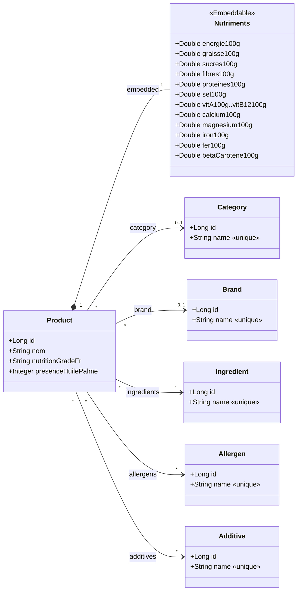

# Diagramme de classes métier — etl-off

## Lecture

- **`Product`** est l'entité centrale. Elle porte ses attributs propres (`nom`,
  `nutritionGradeFr` = score nutritionnel A→E, `presenceHuilePalme`) et **compose** un
  objet valeur **`Nutriments`** (les valeurs pour 100 g).
- **`Category`** et **`Brand`** : associations `*..0..1` (plusieurs produits pour une
  même catégorie/marque ; un produit peut ne pas en avoir).
- **`Ingredient`**, **`Allergen`**, **`Additive`** : associations `*..*`. Chaque référence
  est **unique** en base et partagée par tous les produits qui la contiennent.
- Toutes les entités de référence partagent le même contrat (`id`, `name` unique,
  `equals/hashCode` sur `name`), factorisé dans une classe abstraite `AbstractReferenceEntity`.
