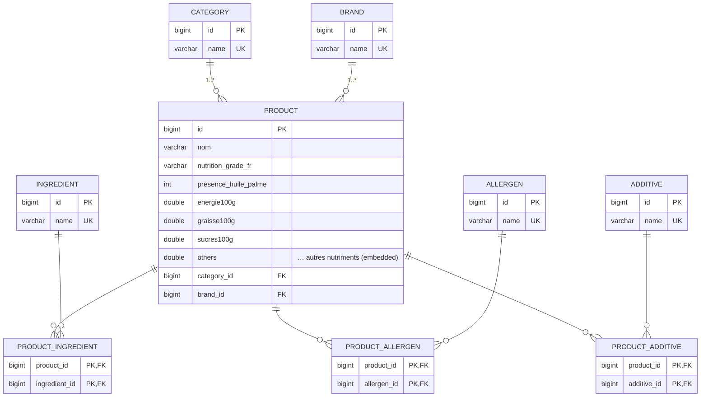

# Modèle Logique / Physique de Données (MLD) — etl-off

## Diagramme entité-association

## Description des tables

### Tables de référence (unicité garantie par `UNIQUE(name)`)

| Table | Colonnes | Contraintes |
|---|---|---|
| `category`   | `id` (PK), `name` | `uk_category_name UNIQUE(name)` |
| `brand`      | `id` (PK), `name` | `uk_brand_name UNIQUE(name)` |
| `ingredient` | `id` (PK), `name` | `uk_ingredient_name UNIQUE(name)` |
| `allergen`   | `id` (PK), `name` | `uk_allergen_name UNIQUE(name)` |
| `additive`   | `id` (PK), `name` | `uk_additive_name UNIQUE(name)` |

### Table `product`

| Colonne | Type | Note |
|---|---|---|
| `id` | bigint (PK) | séquence |
| `nom` | varchar(1024) | non nul |
| `nutrition_grade_fr` | varchar(1) | score A→E, nullable — **indexé** (`idx_product_grade`) |
| `presence_huile_palme` | int | 0/1, nullable |
| `energie100g` … `beta_carotene100g` | double | ~22 colonnes issues de l'`@Embeddable Nutriments` |
| `category_id` | bigint (FK → `category.id`) | **indexé** (`idx_product_category`) |
| `brand_id` | bigint (FK → `brand.id`) | **indexé** (`idx_product_brand`) |

### Tables d'association (many-to-many)

| Table | Clé primaire | Clés étrangères |
|---|---|---|
| `product_ingredient` | (`product_id`, `ingredient_id`) | → `product.id`, → `ingredient.id` |
| `product_allergen`   | (`product_id`, `allergen_id`)   | → `product.id`, → `allergen.id` |
| `product_additive`   | (`product_id`, `additive_id`)   | → `product.id`, → `additive.id` |

## Index (performance des requêtes « top-N »)

- `idx_product_brand (brand_id)` et `idx_product_category (category_id)` : filtrage rapide
  des endpoints `top-by-brand` / `top-by-category`.
- `idx_product_grade (nutrition_grade_fr)` : tri par score nutritionnel.
- Les tables d'association sont indexées via leur clé primaire composite, ce qui accélère
  les agrégations `GROUP BY` des endpoints `/ingredients/top`, `/allergens/top`,
  `/additives/top`.
